## An Evidence-Based Impeachment Guide

Note:

This is an non-partisan, definition-and-evidence summary of the current impeachment case against Donald Trump.

It is written without presuming preexisting knowledge.

Articles of Impeachment are being drawn up against President Trump.  What does that mean?  I'll pull out the relevant definition.

---

### What the US Constitution Says

"***The President***, Vice President and all civil Officers of the United States, ***shall be removed from Office on Impeachment for, and Conviction of***, Treason, ***Bribery***, or other high Crimes and Misdemeanors." - [US Constitution, Article 2, Section 4.](https://www.archives.gov/founding-docs/constitution-transcript#toc-section-4--2)

(Emphasis mine)

Note:

"The President shall be removed from office on Impeachment for, and conviction of, Bribery."

We don't need to debate "High Crimes and Misdemeanors" if the crime is named in the Constition.

What does bribery mean?

---

### Legal Definition of Bribery

"***Whoever"***—
...

2. "***being a public official"*** or person selected to be a public official, "***directly or indirectly, corruptly demands, seeks,"*** receives, accepts, or agrees to receive or accept "***anything of value personally"*** or for any other person or entity, "***in return for:"***

"***a. being influenced in the performance of any official act;"***

...
" - [US Code § 201](https://www.law.cornell.edu/uscode/text/18/201)

Note:

"Whoever, being a public official, directly or indirectly corruptly demands or seeks anything of value personally in return for being influences in the performance of an official act"

taken together,

"The President shall be removed on impeachment and conviction" of directly or indirectly demanding anything of value personally in exchange for being influenced in the performance of an official act".

("Quid pro quo" means "this for that", and describes the "exchange" part.)

So we will lay out two sides of the case.

---

### What we will cover

Part 1. The impeachment case, with requirements, facts, and testimony

Part 2. Counterarguments currently made

Note:

1. The affirmative case for impeachment, with required claims, facts, and testimony.

2. The counterarguments made by Republicans.

So, part 1:

---

### Part 1:

Did Donald Trump seek something of personal value in return for official government policy?

Note:

Did Donald Trump seek a thing of value in return for being influenced in the performance of an official act?  Three things need to be true.

---

### Claims Required For Proof

1. Trump sought/demanded an exchange of:
2. an official act
3. for a thing of value

Note:

(Read slide)

---

Without _all three_ of those things, there is no bribery.

Without seeking/a demand, there is no bribery.
Without the "thing of value" that is not part of his job, there is no bribery.

Note:

(Read slide)

---

But note: the transaction doesn't have to go through.

The demand itself is sufficient.

For example, if a teacher says "if you want to pass this class you'll sleep with me" and the student calls the cops, it doesn't matter if sex happened; the solicitation itself is illegal.

Note:

(Read slide)

Now, what actually happened?

---

#### Key events

**Phase 1: Up to July 2019**

 * "Irregular" channels
 * Pressure for "investigations" to get white house visit
 * July 10 Meeting (Bolton, Hill, Vindman)

---

##### This is William Taylor

---

##### Taylor: Who are the actors?

Note:

What did we just hear?

+++

##### Taylor: Who are the actors?

AT THE SAME TIME HOWEVER, I
ENCOUNTERED AN IRREGULAR
INFOLLOW CHANNEL OF U.S. POLICY
MAKING UNACCOUNTABLE TO
CONGRESS, A CHANNEL THAT
INCLUDED THEN SPECIAL ENJOY KURT
VOLKER, U.S. AMBASSADOR GORDON
SONDLOND, RICK PERRY, MICK
MULVANEY AND AS I SUBSEQUENTLY
LEARNED, MR. GIULIANI.
I WAS CLEARLY IN THE REGULAR
CHANNEL, BUT I WAS ALSO IN THE
IRREGULAR ONE TO THE EXPENT THAT
AMBASSADORS VOLKER AND SONDLAND
INCLUDED ME IN CERTAIN
CONVERSATIONS.

---

### "Irregular" Diplomatic Channels

Sondland, Volker, Giuliani, and Mulvaney were in an "irregular" diplomatic channel unaccountable to Congress.  What did they think was happening?

Note:

(Read slide)

---

##### Sondland's Perspective

Note:

Sondland flatly states "investigations into 2016 and Burisma were requirements for a White House visit".

That is a requirement of a thing for an official act.  Was it thing of value?  We'll come back to that.

This is a pretty black-and-white statement.  But there is more evidence from other witnesses.

+++

##### Sondland's Perspective

"Was there a quid pro quo? As I testified previously with regard to the requested White House call and the White House meeting, the answer is yes. Mr. Giuliani conveyed to Secretary Perry, Ambassador Volker and others that President Trump wanted a public statement from President Zelensky committing to investigations of Burisma and the 2016 election. Mr. Giuliani expressed those requests directly to the Ukrainians and Mr. Giuliani also expressed those requests directly to us."[Source](https://youtu.be/EkN4P7R5stE?t=5554)

---

On July 10, there was an especially controversial meeting between US staff and a Ukrainian representative.

Note:

(Read slide)

What did they say?

---

##### July 10 Meeting

Vindman Testimony:

Note:

In the July 10 meeting, Sondland told the Ukrainian rep "you get a meeting when you announce these investigations."

---

##### July 10 Meeting, 2

Hill Testimony:

Note:

Hill corroborates the messages Sondland sent to Ukraine, and testifies that Bolton knew the arrangement was improper; a "drug deal" that also involved White House Chief-of-staff Mick Mulvaney.

The Ukrainians knew about a demand for announcement of investigations into Burisma to get a White House meeting.

Now, we get to the aid freeze, the famous July 25 phone call, and "what Trump really cared about".

---

#### Key events

**Phase 2: July 2019**

 * July 12 Ukraine aid is frozen
 * July 25 Call
 * July 26 Sondland meeting

---

##### Aid frozen by Chief of Staff for President

@div[top]
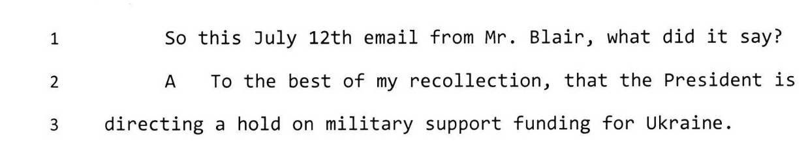
@divend

@div[top]
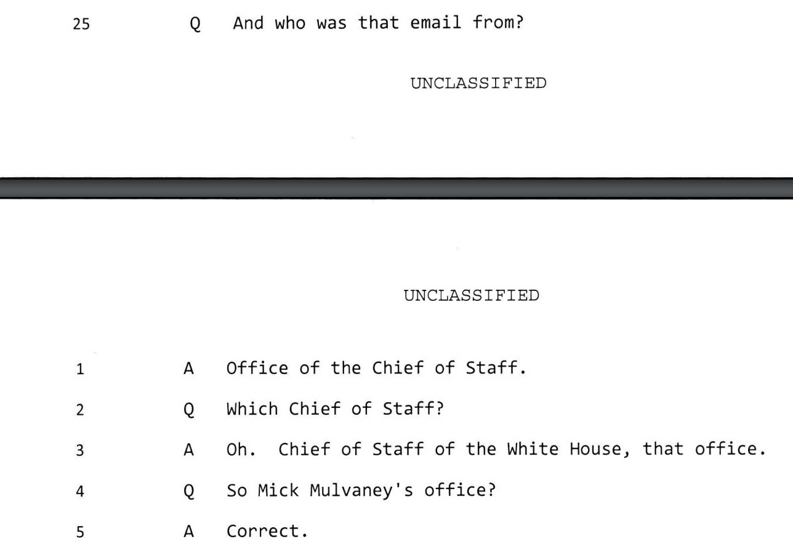
@divend

Note:

From house intelligence testimony, we know Mulvaney froze the $400 in congressionally-approved Ukraine aid in July.  (Source in the slides, shared at the end.)

Then, the famouse call.
+++

[Source](https://intelligence.house.gov/uploadedfiles/sandy_final_redacted.pdf)

---

##### July 25 Call

On July 25, a call occurred between President Trump and the President of Ukraine, Zelensky.

Note:

(Read slide)

---

##### July 25 Call

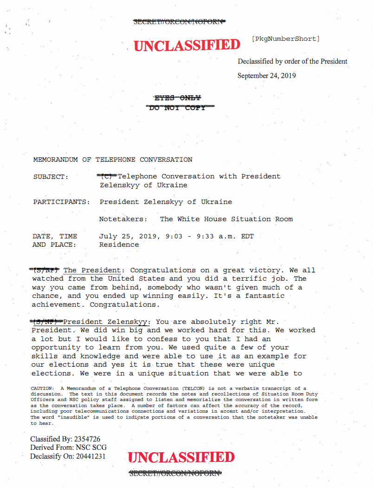

Note:

It is four pages, the first being this one.

---

##### July 25 Call, Snippet 1

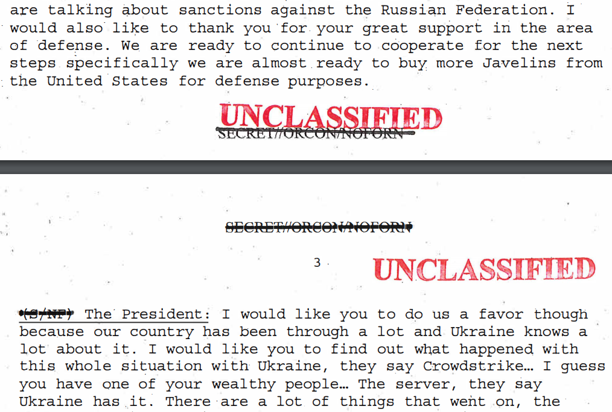

Note:

Zelensky: We are almost ready to buy more Javelins for defense purposes.

Trump: I would like you to do us a favor though... Trump mentions "crowdstrike" and "the server".

---

##### July 25 Call, Snippet 2

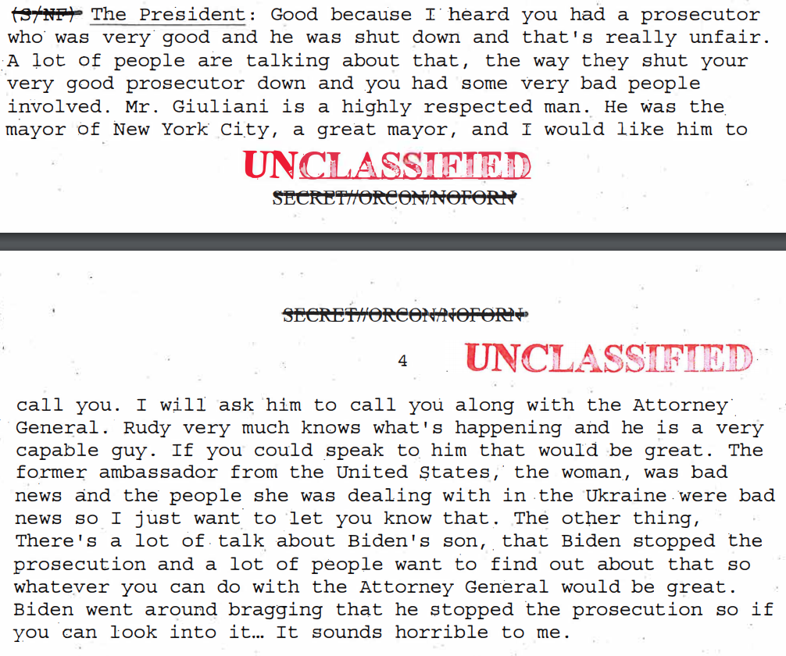

Note:

Later, "Giuliani is a highly respected man."  and "If you could speak with him that would be great."

He specifically names Joe Biden: "The other thing, there's a lot of talk about Biden's son, that he stopped the prosecution" and "whatever you can do with the attorney general would be great."

---

##### July 25 Call, Snippet 3

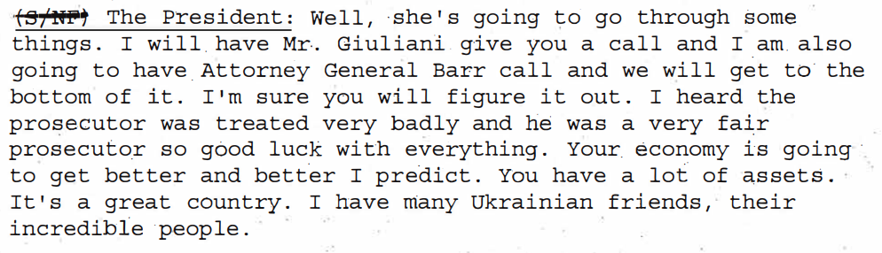

Note:

Finally, "I will have Mr Giuliani give you a call."

So, was Trump concerned about Ukraine?  Was Trump concerned about Biden?  Whose interests mattered to him?  David Holmes had a meal with Sondland and asked.

---

##### Did Trump expect a Biden investigation?

Holmes testimony:

Note:

Trump cared about "big stuff that benefis the President, like the Biden investigation that Giuliani was pushing."

"stuff that benefits the President" _is_ "personally valuable".  Also, Trump pointed Zelensky at Giuliani, who was pushing "the Biden investigation".

This is pretty clear-cut: "talk to my man, who is pushing the investigation that benefits me.  Also, I don't give a shit about Ukraine.  Then you get your meeting."

There aren't many ways to make it _more_ obvious, because it's soliciting a bribe and you just can't shout that for everyone to know.

But:

+++

I TOOK THE OPPORTUNITY TO ASK
HIM FOR HIS CANDID IMPRESSION OF
THE PRESIDENT'S VIEWS ON
UKRAINE.
IN PARTICULAR, I ASKED
AMBASSADOR SONDLAND IF IT WAS
TRUE THAT THE PRESIDENT DID NOT
GIVE AN EXPLETIVE ABOUT UKRAINE.
AMBASSADOR SONDLAND AGREED THE
PRESIDENT DID NOT GIVE AN
EXPLETIVE ABOUT UKRAINE.
I ASKED WHY NOT.
AMBASSADOR SONDLAND STATED THE
PRESIDENT ONLY CARES ABOUT BIG
STUFF.
I NOTED THERE WAS BIG STUFF
GOING ON IN UKRAINE, LIKE A WAR
WITH RUSSIA.
AMBASSADOR SONDLAND REPLIED HE
MEANT BIG STUFF THAT BENEFITS
THE PRESIDENT, LIKE THE BIDEN
INVESTIGATION, THAT MR. GIULIANI
WAS PUSHING.
THE CONVERSATION THEN MOVED ON
TO OTHER TOPICS.

---

Aside from the White House meeting, what about the withheld aid?

Was that withheld to seek a thing of value?

Note:

(Read slide)

---

##### Was the aid withheld to induce investigation announcement?

Sondland says yes:

Note:

So, Sondland says yes.

Mulvaney placed the hold on the aid, and was the other part of the "drug deal".  What did he say?

+++

##### Was the aid withheld to induce investigation announcement?

I TRIED DILIGENTLY TO ASK WHY
THE AID WAS SUSPENDED BUT I
NEVER RECEIVED A CLEAR ANSWER.
STILL HAVEN'T TO THIS DAY.
IN THE ABSENCE OF ANY CREDIBLE
EXPLANATION FOR THE SUSPENSION
OF AID, I LATER CAME TO BELIEVE
THAT THE RESUMPTION OF SECURITY
AID WOULD NOT OCCUR UNTIL THERE
WAS A PUBLIC STATEMENT FROM
UKRAINE COMMITTING TO THE
INVESTIGATIONS OF THE 2016
ELECTIONS AND BURISMA AS
MR. GIULIANI HAD DEMANDED.

---

##### Was the aid withheld to induce investigation announcement?

Mulvaney says yes:

Press Conference, Oct 17

Note:

That's pretty direct.  Mulvaney has since walked that statement back, because it's close to saying "yes we did it"; more on that later.

Did the Ukrainians know the aid was conditioned on investigations? On July 25th they were curious:

+++

##### Was the aid withheld to induce investigation announcement?

report demand for an investigation into
the Democrats was part of the reason
that he it was on to withhold funding to
Ukraine we look back to what happened in
2016

certainly was was part of the thing that
he was worried about in corruption with
that nation and that is absolutely a
broken yeah which which ultimately then
flowed by the way there was a report

---

##### Did the Ukrainians know about the withheld aid?

Cooper's Testimony:

Note:

And Sondland _told a senior Ukrainian official_ the aid was conditioned on investigations.

---

##### Did the Ukrainians know about the this-for-that exchange?

Morrison's Testimony:

(September meeting with Yermak)

Note:

That's pretty direct.  This is the definition of a quid pro quo.

By this point, thinge were getting tense.

+++

##### Morrison on Sondland: Was the aid withheld to induce investigation announcement?

"WHAT DID AMBASSADOR SONDLAND
TELL YOU THAT HE TOLD MR.
YERMAK?"

"THAT THE UKRAINIANS WOULD
HAVE TO HAVE THE PROSECUTOR
GENERAL MAKE A STATEMENT WITH
RESPECT TO THE INVESTIGATIONS AS
A CONDITION OF HAVING THE AID
LIFTED."

---

#### Key events

**Phase 3: Investigations starting**

 * August 12: Whistleblower files complaint
 * August 28: [Politico](https://www.politico.com/story/2019/08/28/trump-ukraine-military-aid-russia-1689531) breaks news on aid withholding
 * Sept 9: Congress told of whistleblower complaint, announces inquiry
 * Sept 10: Bolton Resigns
 * Sept 11: Aid released

Note:

A listener on the July 25 call filed a complaint on August 12, claiming the actions on the call were improper.

On July 28, Politico published the fact that the aid was held up.

And in a very tense three days,

First Congress received notice of the complaint and announced investigations
Then the next day "I won't be part of this drug deal" Bolton resigned/was dismissed
Then the next day the aid was released.

---

#### Three claims revisited

1. Trump sought/demanded an exchange of
2. an official act (white house meeting OR Ukraine military aid)
3. for a thing of value (investigations)

But the thing must be _personally_ valuable, not just valuable overall, thus:

 * the investigations must also be primarily for the President's benefit.

---

#### Summary so far

Sondland: "There was a quid pro quo."  Rudy Giuliani was the primary messenger.

Sondland told President Zelensky's assistant "announce the investigations to get the military aid."

**This is claims 1-3.**

But were the investigations primarily valuable to Trump?  Giuliani thought so.

---

#### May 9 2019 NYT story

Giuliani was planning in May to go to Ukraine, but scrapped the trip due to controversy.

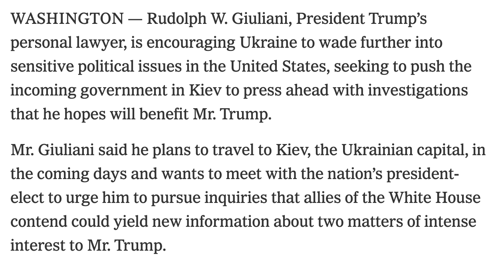

Note:

(Read title, then read second para)

+++

[Source](https://www.nytimes.com/2019/05/09/us/politics/giuliani-ukraine-trump.html)

---

#### May 9 2019 NYT story

Note:

(Read first para)

+++

[Source](https://www.nytimes.com/2019/05/09/us/politics/giuliani-ukraine-trump.html)

---

#### May 9 2019 NYT story

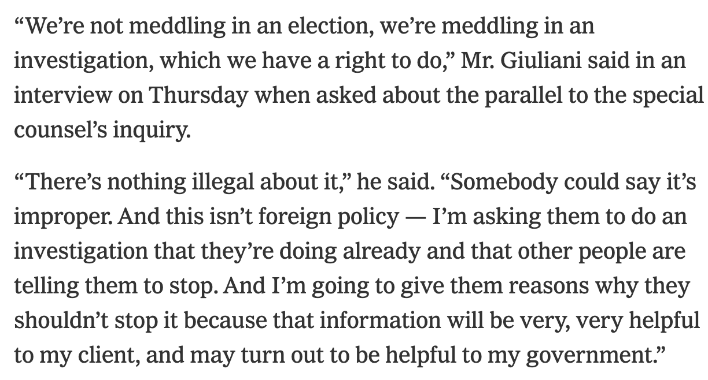

Note:

(Read all)

What about the trips Giuliani eventually did make?  His defense is... spotty.

+++

[Source](https://www.nytimes.com/2019/05/09/us/politics/giuliani-ukraine-trump.html)

---

#### Giuliani's account of his actual trip is uneven

Note:

And Trump has moved to open channels to advocate for investigations.

---

#### Trump openly calls for foreign governments to investigate Joe Biden

Note:

(video)

Take note: if you have a case with lots of evidence to make, you don't just keep repeating your desired conclusion, handwaving gossip about "it was just as bad".  You might for example, link your sources, edit for clarity, and maybe make slides.

But a key question: Does this primarily benefit Trump?

---

Obviously, Trump benefits from saying "my primary political opponents is now under investigation by Ukraine/China", because it makes his opponent less electable.

Obviously, a story of "Russia did not intervene for Trump, Ukraine framed them" is good for Trump, because it removes a question around how legitimate his win was (and what it means when Russia supports you).

Note:
(Read slide)

This is still contrary to what US Intel holds about the 2016 election.  They say Russia did interfered, and that Ukraine did not.

---

These are the two _most_ useful investigations for Trump, and they (tellingly) have nothing to do with getting Ukraine to make anticorruption reforms.

Note:

What do Republicans say?

---

##### Republican Counterarguments

 * Biden pressuring for Shokin's removal was corrupt
 * No harm, no foul: aid was released
 * No harm, no foul: Ukraine did not know aid was blocked
 * "Just concerned about corruption"
 * "Crowdstrike" concern was legitimate

Note:

(Read slide)

Let's evaluate these in order.

---

#### Prosecutor Shokin was corrupt

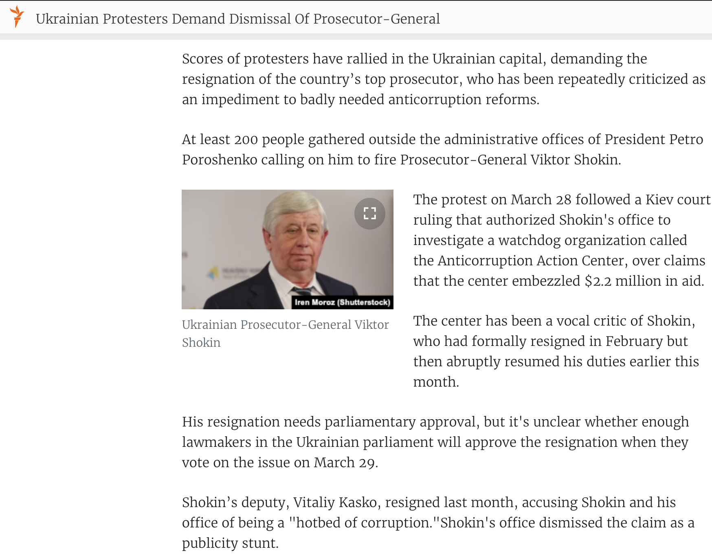

+++

[source](https://m.facebook.com/usdos.ukraine/posts/10153248488506936)

---

#### Prosecutor Shokin protected Burisma's owner, rather than prosecuting him

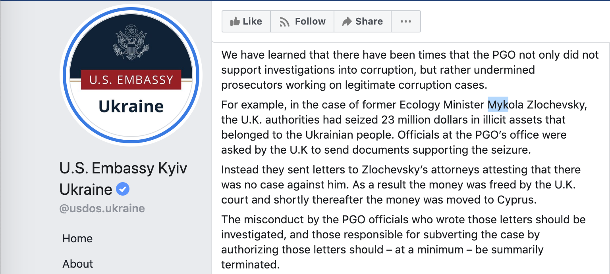

+++

[source](https://www.rferl.org/a/ukraine-protest-prosecutor-shokin-dismissal/27639981.html)

---

#### Ukrainians say Burisma investigation was already wound down

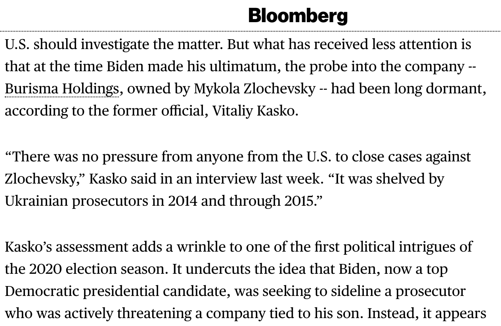

+++

[source](https://www.bloomberg.com/news/articles/2019-05-07/timeline-in-ukraine-probe-casts-doubt-on-giuliani-s-biden-claim)

---

##### Republican Counterarguments

 * ~~Biden pressuring for Shokin's removal was corrupt~~

 * No harm, no foul: aid was released
 * No harm, no foul: Ukraine did not know aid was blocked
 * "Just concerned about corruption"
 * "Crowdstrike" concern was legitimate

---

### Just solicitation is illegal

"***Whoever"***—
...

2. "***being a public official"*** or person selected to be a public official, "***directly or indirectly, corruptly demands, seeks,"*** receives, accepts, or agrees to receive or accept "***anything of value personally"*** or for any other person or entity, "***in return for:"***

"***a. being influenced in the performance of any official act;"***

...
" - [US Code § 201](https://www.law.cornell.edu/uscode/text/18/201)

Note:

Just _seeking_ payment via "if you want me to approve your application you will pay me $1000" as a public official is itself illegal.

---

### Aid released two days after investigations start

Congress announced investigations into Giuliani and Trump pursuing politically-motivated investigations on September 9.

The aid was released on Sept 11.

This is like rescinding the demand after the cops announce an inquiry; it doesn't undo the crime.

---

##### Republican Counterarguments

 * ~~Biden pressuring for Shokin's removal was corrupt~~
 * ~~No harm, no foul: aid was released~~

 *  No harm, no foul: Ukraine did not know aid was blocked
 *  "Just concerned about corruption"
 *  "Crowdstrike" concern was legitimate

---

### The Ukrainians Asked About The Blocked Aid

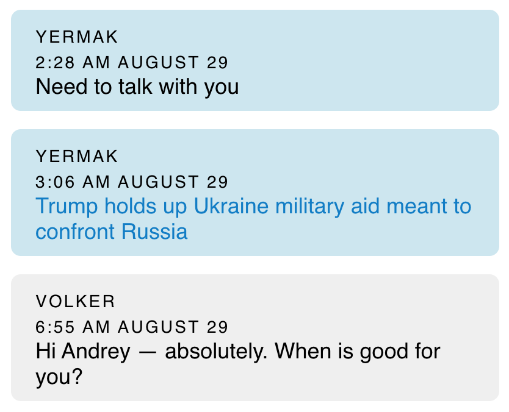

(And also Cooper's testimony "what is going on with the aid", and Sondland conveying the quid pro quo demand.)

---

##### Republican Counterarguments

 * ~~Biden pressuring for Shokin's removal was corrupt~~
 * ~~No harm, no foul: aid was released~~
 * ~~No harm, no foul: Ukraine did not know aid was blocked~~

 * "Just concerned about corruption"
 * "Crowdstrike" concern was legitimate

---

##### "Just concerned about corruption"

> "And I’m going to give them reasons why they shouldn’t stop it because that information will be very, very helpful to my client, and may turn out to be helpful to my government." - Rudy Giuliani

Note:

"We're just concerned about corruption" doesn't pass the smell test.

---

##### "Just concerned about corruption"

The two possible investigations that are _most valuable_ to Trump are ones saying Ukraine, not Russia, intervened in 2016 and that his primary political opponent was corrupt.

Neither of these addresses systematic Ukrainian corruption.

"Corruption" is not mentioned at all on the July 25 call, or an earlier call with Trump and Zelensky.

The Trump administration has actually _cut_ anticorruption funds to Ukraine.

Note:

(Read slide.)

---

##### "Just concerned about corruption" but cut anticorruption funding

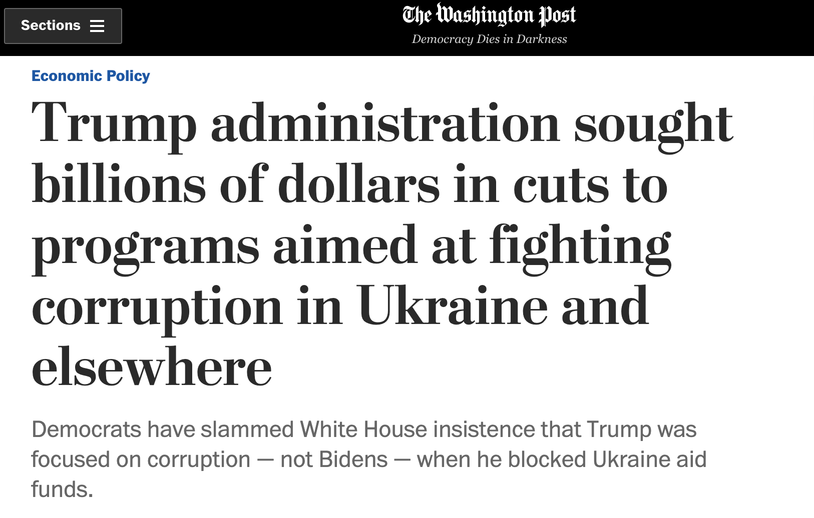

Note:

So what is left?

---

##### Republican Counterarguments

 *  ~~Biden pressuring for Shokin's removal was corrupt~~
 *  ~~No harm, no foul: aid was released~~
 *  ~~No harm, no foul: Ukraine did not know aid was blocked~~
 *  ~~"Just concerned about corruption"~~

 * "Crowdstrike" concern was legitimate

Note:

Crowdstrike is a cybersecurity firm partially owned by a rich Russian.  It is involved in a conspiracy theory claiming that Ukraine interfered in the 2016 election and framed Russia for it.

---

#### "Crowdstrike theory" is Russian propaganda

Note:

From the rest of Hill's and Taylor's testimony, the message is clear: support for Ukraine is important to US interests.  There is a hot war with Russia there, and we don't want to see foreign powers emboldened to attack allies of the US.

---

Where does this leave us?

---

Trump's coconspirators openly admittedly that a WH visit and foreign aid were held up to induce investigations into 2016 interference and Joe Biden.  Sondland said "Was there a quid pro quo?  The answer is yes."

---

The investigations Trump sought had nothing to do with Ukrainian corruption, but were the two _most useful_ to Trump.

One undermined US Intelligence's conclusion that Russia intervened to support Trump.

The other painted Trump's primary political rival as corrupt, contrary to all reports that the removed prosecutor was corrupt.

---

Innocent people don't:
 * block witnesses from testifying,
 * withhold documents,
 * set up backchannels through their personal lawyer
 * parrot propaganda from Russian Security Services

All of which the Trump administration has done.

---

But this isn't about Trump, or Democrats, or Republicans.

It's about corruption in the US.

---

If we don't punish abuse of office when it is so public and obvious, it will infest the system, because people will expect to get away with it.  After all, if public corruption is not punished, private corruption definitely won't be.

---

We need to maintain faith and respectability in our government by punishing misdeeds, and leaving a trustworthy system to our children.  Letting the rot set in is unacceptable.

---

---
If you appreciated this video, please:

* Watch it with someone
* Share it with 2-3 people you think would benefit from it.  (Personal recommendations matter!)

---
