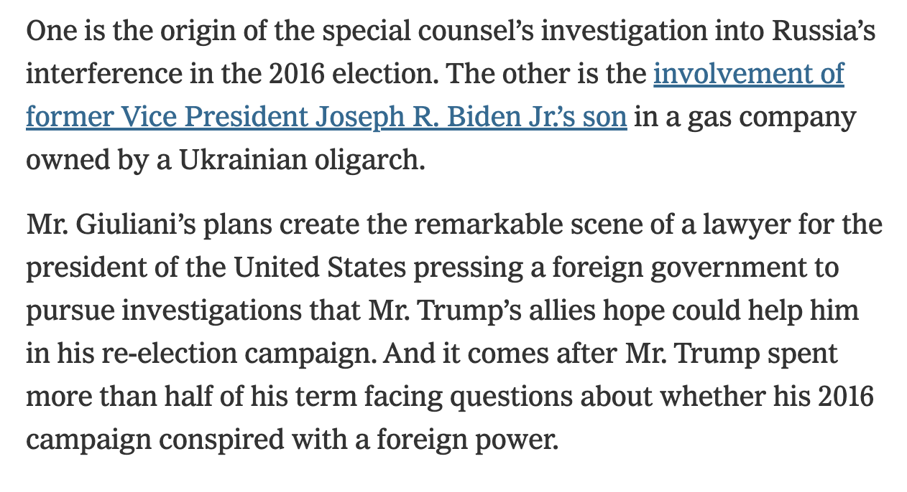

## An Evidence-Based Impeachment Guide

+++

This is an non-partisan, definition-and-evidence summary of the current impeachment case against Donald Trump.

It is written for unbiased presentation, without presuming preexisting knowledge.

---

### What the US Constitution Says

"***The President***, Vice President and all civil Officers of the United States, ***shall be removed from Office on Impeachment for, and Conviction of***, Treason, ***Bribery***, or other high Crimes and Misdemeanors." - [US Constitution, Article 2, Section 4.](https://www.archives.gov/founding-docs/constitution-transcript#toc-section-4--2)

(Emphasis mine)

---

### Legal Definition of Bribery

"***Whoever"***—
...

2. "***being a public official"*** or person selected to be a public official, "***directly or indirectly, corruptly demands, seeks,"*** receives, accepts, or agrees to receive or accept "***anything of value personally"*** or for any other person or entity, "***in return for:"***

"***a. being influenced in the performance of any official act;"***

...
" - [US Code § 201](https://www.law.cornell.edu/uscode/text/18/201)

+++

### Which means

"The President shall be removed on impeachment and conviction" of "directly or indirectly demanding anything of value personally in exchange for being influenced in the performance of an official act".

("Quid pro quo" means "this for that", and describes the "exchange" part.)

---

### What we will cover

Part 1. The impeachment case, with requirements, facts, and testimony

Part 2. Counterarguments made by Republicans

---

### Part 1:

Did Donald Trump seek a thing of value in return for being influenced in the performance of an official act?

---

### Claims Required For Proof

1. Trump sought/demanded an exchange of:
2. an official act
3. for a thing of value

---

Without _all three_ of those things, there is no bribery.

Without seeking/a demand, there is no bribery.
Without the "thing of value" that is not part of his job, there is no bribery.

---

But note: the transaction doesn't have to go through.

The demand itself is sufficient.

For example, if a teacher says "if you want to pass this class you'll sleep with me" and the student calls the cops, it doesn't matter if sex happened; the solicitation itself is illegal.

---

#### Key events

**Phase 1: Up to July 2019**

 * "Irregular" channels
 * Pressure for "investigations" to get white house visit
 * July 10 Meeting (Bolton, Hill, Vindman)

---

##### Taylor: Who are the actors?

+++

##### Taylor: Who are the actors?

AT THE SAME TIME HOWEVER, I
ENCOUNTERED AN IRREGULAR
INFOLLOW CHANNEL OF U.S. POLICY
MAKING UNACCOUNTABLE TO
CONGRESS, A CHANNEL THAT
INCLUDED THEN SPECIAL ENJOY KURT
VOLKER, U.S. AMBASSADOR GORDON
SONDLOND, RICK PERRY, MICK
MULVANEY AND AS I SUBSEQUENTLY
LEARNED, MR. GIULIANI.
I WAS CLEARLY IN THE REGULAR
CHANNEL, BUT I WAS ALSO IN THE
IRREGULAR ONE TO THE EXPENT THAT
AMBASSADORS VOLKER AND SONDLAND
INCLUDED ME IN CERTAIN
CONVERSATIONS.

---

### "Irregular" Diplomatic Channels Conclusion:

Sondland, Volker, Giuliani, and Mulvaney were in a diplomatic backchannel unaccountable to Congress.

---

##### Sondland's Perspective

+++

##### Sondland's Perspective

"Was there a quid pro quo? As I testified previously with regard to the requested White House call and the White House meeting, the answer is yes. Mr. Giuliani conveyed to Secretary Perry, Ambassador Volker and others that President Trump wanted a public statement from President Zelensky committing to investigations of Burisma and the 2016 election. Mr. Giuliani expressed those requests directly to the Ukrainians and Mr. Giuliani also expressed those requests directly to us."[Source](https://youtu.be/EkN4P7R5stE?t=5554)

---

On July 10, there was an especially controversial meeting between US staff and a Ukrainian representative.

This is the meeting where the "I am not a part of whatever drug deal Mulvaney and Sondland are cooking up" quote comes from.

---

##### July 10 Meeting

Vindman Testimony:

---

##### July 10 Meeting, 2

Hill Testimony:

---

##### The July 10 Meeting Conclusions

Sondland told Ukrainians about investigations "deliverable" being required for meeting with Trump on July 10, and there was an agreement with Chief of Staff Mick Mulvaney.

The Ukrainians knew about a demand for announcement of investigations into Burisma to get a White House meeting.

---

#### Key events

**Phase 2: July 2019**

 * July 12 Ukraine aid is frozen
 * July 25 Call
 * July 26 Sondland meeting

---

##### Aid frozen by Chief of Staff for President

@div[top]

@divend

@div[top]

@divend

+++

[Source](https://intelligence.house.gov/uploadedfiles/sandy_final_redacted.pdf)

---

##### July 25 Call

On July 25, a call occurred between President Trump and the President of Ukraine, Zelensky.  These are the key passages:

---

##### July 25 Call

---

##### July 25 Call, Snippet 1

---

##### July 25 Call, Snippet 2

---

##### July 25 Call, Snippet 3

---

##### Did Trump expect a Biden investigation?

Holmes testimony:

+++

I TOOK THE OPPORTUNITY TO ASK
HIM FOR HIS CANDID IMPRESSION OF
THE PRESIDENT'S VIEWS ON
UKRAINE.
IN PARTICULAR, I ASKED
AMBASSADOR SONDLAND IF IT WAS
TRUE THAT THE PRESIDENT DID NOT
GIVE AN EXPLETIVE ABOUT UKRAINE.
AMBASSADOR SONDLAND AGREED THE
PRESIDENT DID NOT GIVE AN
EXPLETIVE ABOUT UKRAINE.
I ASKED WHY NOT.
AMBASSADOR SONDLAND STATED THE
PRESIDENT ONLY CARES ABOUT BIG
STUFF.
I NOTED THERE WAS BIG STUFF
GOING ON IN UKRAINE, LIKE A WAR
WITH RUSSIA.
AMBASSADOR SONDLAND REPLIED HE
MEANT BIG STUFF THAT BENEFITS
THE PRESIDENT, LIKE THE BIDEN
INVESTIGATION, THAT MR. GIULIANI
WAS PUSHING.
THE CONVERSATION THEN MOVED ON
TO OTHER TOPICS.

---

##### The July 25/26 conclusions

In response to President Zelensky talking about Javelin missles, President Trump said "I would like you to do us a favor though", and brought up 3 key topics:

1. Crowdstrike, "the server"
2. "If you could speak with him [Rudy,] that would be great"
3. "look into" Vice President Biden stopping a prosecution related to his son

---

Aside from the White House meeting, what about the withheld aid?

Was that withheld to seek a thing of value?

---

##### Was the aid withheld to induce investigation announcement?

Sondland says yes:

+++

##### Was the aid withheld to induce investigation announcement?

I TRIED DILIGENTLY TO ASK WHY
THE AID WAS SUSPENDED BUT I
NEVER RECEIVED A CLEAR ANSWER.
STILL HAVEN'T TO THIS DAY.
IN THE ABSENCE OF ANY CREDIBLE
EXPLANATION FOR THE SUSPENSION
OF AID, I LATER CAME TO BELIEVE
THAT THE RESUMPTION OF SECURITY
AID WOULD NOT OCCUR UNTIL THERE
WAS A PUBLIC STATEMENT FROM
UKRAINE COMMITTING TO THE
INVESTIGATIONS OF THE 2016
ELECTIONS AND BURISMA AS
MR. GIULIANI HAD DEMANDED.

---

##### Was the aid withheld to induce investigation announcement?

Mulvaney says yes:

Press Conference, Oct 17

+++

##### Was the aid withheld to induce investigation announcement?

report demand for an investigation into
the Democrats was part of the reason
that he it was on to withhold funding to
Ukraine we look back to what happened in
2016

certainly was was part of the thing that
he was worried about in corruption with
that nation and that is absolutely a
broken yeah which which ultimately then
flowed by the way there was a report

---

##### Did the Ukrainians know about the withheld aid?

Cooper's Testimony:

---

##### Did the Ukrainians know about the this-for-that exchange?

Morrison's Testimony:

(September meeting with Yermak)

+++

##### Morrison on Sondland: Was the aid withheld to induce investigation announcement?

"WHAT DID AMBASSADOR SONDLAND
TELL YOU THAT HE TOLD MR.
YERMAK?"

"THAT THE UKRAINIANS WOULD
HAVE TO HAVE THE PROSECUTOR
GENERAL MAKE A STATEMENT WITH
RESPECT TO THE INVESTIGATIONS AS
A CONDITION OF HAVING THE AID
LIFTED."

---

#### Key events

**Phase 3: Investigations starting**

 * August 12: Whistleblower files complaint
 * August 28: [Politico](https://www.politico.com/story/2019/08/28/trump-ukraine-military-aid-russia-1689531) breaks news on aid withholding
 * Sept 9: Congress told of whistleblower complaint, announces inquiry
 * Sept 10: Bolton Resigns
 * Sept 11: Aid released

---

#### Three claims revisited

1. Trump sought/demanded an exchange of
2. an official act (white house meeting OR Ukraine military aid)
3. for a thing of value (investigations)

But the thing must be _personally_ valuable, not just valuable overall, thus:

4. the investigations must also not be principally for the President's benefit.

---

#### Summary so far

For White House meetings, Sondland flatly said "Was there a quid pro quo?  The answer is yes." and indicated Rudy Giuliani as the primary messenger.

In September, Sondland told President Zelensky's aide (Yermak) "announce the investigations to get the aid."

Those facts substantiate 1, 2, and 3; Trump sought/demanded indirectly (through other people) something he wanted in exchange for official acts.

But were the investigations primarily valuable to Trump?  Giuliani thought so

---

#### May 9 2019 NYT story

Giuliani was planning in May to go to Ukraine, but scrapped the trip due to controversy.

+++

[Source](https://www.nytimes.com/2019/05/09/us/politics/giuliani-ukraine-trump.html)

---

#### May 9 2019 NYT story

+++

[Source](https://www.nytimes.com/2019/05/09/us/politics/giuliani-ukraine-trump.html)

---

#### May 9 2019 NYT story

+++

[Source](https://www.nytimes.com/2019/05/09/us/politics/giuliani-ukraine-trump.html)

---

#### Giuliani's account of his actual trip is uneven

---

#### Trump openly calls for foreign governments to investigate Joe Biden

---

It is plain Trump benefits from saying "my primary political opponents is now under investigation by Ukraine/China", because it makes his opponent less electable.

---

##### Republican Counterarguments

 * Biden pressuring for Shokin's removal was corrupt
 * No harm, no foul: aid was released
 * No harm, no foul: Ukraine did not know aid was blocked
 * "Just concerned about corruption"
 * "Crowdstrike" concern was legitimate

---

#### Prosecutor Shokin was corrupt

+++

[source](https://m.facebook.com/usdos.ukraine/posts/10153248488506936)

---

#### Prosecutor Shokin protected Burisma's owner, rather than prosecuting him

+++

[source](https://www.rferl.org/a/ukraine-protest-prosecutor-shokin-dismissal/27639981.html)

---

#### Ukrainians say Burisma investigation was already wound down

+++

[source](https://www.bloomberg.com/news/articles/2019-05-07/timeline-in-ukraine-probe-casts-doubt-on-giuliani-s-biden-claim)

---

##### Republican Counterarguments

 * ~~Biden pressuring for Shokin's removal was corrupt~~

 * No harm, no foul: aid was released
 * No harm, no foul: Ukraine did not know aid was blocked
 * "Just concerned about corruption"
 * "Crowdstrike" concern was legitimate

---

### Just solicitation is illegal

"***Whoever"***—
...

2. "***being a public official"*** or person selected to be a public official, "***directly or indirectly, corruptly demands, seeks,"*** receives, accepts, or agrees to receive or accept "***anything of value personally"*** or for any other person or entity, "***in return for:"***

"***a. being influenced in the performance of any official act;"***

...
" - [US Code § 201](https://www.law.cornell.edu/uscode/text/18/201)

Note:

Just _seeking_ payment via "if you want me to approve your application you will pay me $1000" as a public official is itself illegal.

---

### Aid released two days after investigations start

Congress announced investigations into Giuliani and Trump pursuing politically-motivated investigations on September 9.

The aid was released on Sept 11.

This is like rescinding the demand after the cops announce an inquiry.

---

##### Republican Counterarguments

 * ~~Biden pressuring for Shokin's removal was corrupt~~
 * ~~No harm, no foul: aid was released~~

 *  No harm, no foul: Ukraine did not know aid was blocked
 *  "Just concerned about corruption"
 *  "Crowdstrike" concern was legitimate

---

### The Ukrainians Asked About The Blocked Aid

(And also Cooper's testimony "what is going on with the aid".)

---

##### Republican Counterarguments

 * ~~Biden pressuring for Shokin's removal was corrupt~~
 * ~~No harm, no foul: aid was released~~
 * ~~No harm, no foul: Ukraine did not know aid was blocked~~

 * "Just concerned about corruption"
 * "Crowdstrike" concern was legitimate

---

##### "Just concerned about corruption"

> "And I’m going to give them reasons why they shouldn’t stop it because that information will be very, very helpful to my client, and may turn out to be helpful to my government." - Rudy Giuliani

---

##### "Just concerned about corruption"

The two possible investigations that are _most valuable_ to Trump are ones saying Ukraine, not Russia, intervened in 2016 and that his primary political opponent was corrupt.

Neither of these addresses systematic Ukrainian corruption.

"Corruption" is not mentioned at all on the July 25 call, or an earlier call with Trump and Zelensky.

---

##### Republican Counterarguments

 *  ~~Biden pressuring for Shokin's removal was corrupt~~
 *  ~~No harm, no foul: aid was released~~
 *  ~~No harm, no foul: Ukraine did not know aid was blocked~~
 *  ~~"Just concerned about corruption"~~

5. "Crowdstrike" concern was legitimate

Note:

Crowdstrike is a cybersecurity firm partially owned by a rich Russian.  It is involved in a conspiracy theory claiming that Ukraine interfered in the 2016 election and framed Russia for it.

---

#### "Crowdstrike theory" is Russian propaganda

---

Where does this leave us?

---

Trump's coconspirators openly admittedly that a WH visit and foreign aid were held up to induce investigations into 2016 interference and Joe Biden.  Sondland said "Was there a quid pro quo?  The answer is yes."

---

The investigations Trump sought had nothing to do with Ukrainian corruption, but were the two _most useful_ to Trump.

One undermined US Intelligence's conclusion that Russia intervened to support Trump.

The other painted Trump's primary political rival as corrupt, contrary to all reports that the removed prosecutor was corrupt.

---

Innocent people don't:
 * block witnesses from testifying,
 * withhold documents,
 * set up backchannels through their personal lawyer
 * parrot propaganda from Russian Security Services

All of which the Trump administration has done.

---

President Trump violated the Constitution, and committed a crime the Constitution specifically names as grounds for removal.

If the US Constitution matters, Trump is guilty.

---
